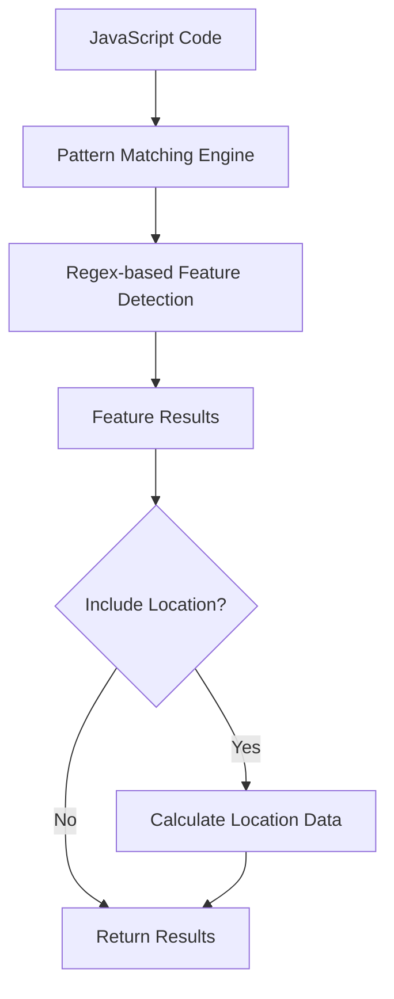
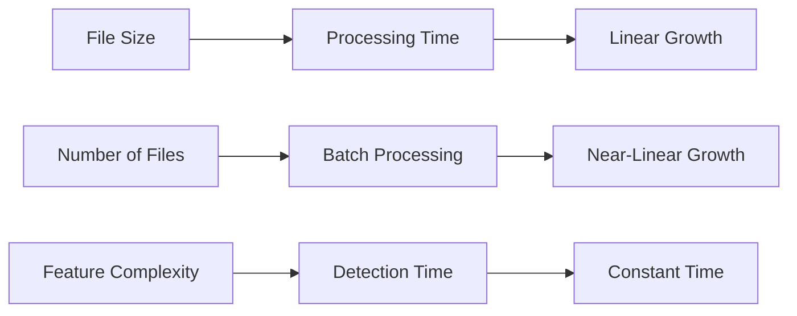

## How fast-brake Works

fast-brake revolutionizes ES feature detection through **high-performance pattern matching** and a flexible plugin architecture.



This approach delivers up to **85x faster performance** with targeted plugins compared to traditional AST parsers.

## Core Architecture Components

### 1. Detector Engine (`src/detector.ts`)

The **Detector** is the main engine that performs pattern-based feature detection.

```typescript
class Detector {
  // High-performance pattern scanning
  scan(code: string, options?: DetectionOptions): DetectedFeature[]
  
  // Main detection method
  detect(code: string, options: DetectionOptions): DetectedFeature[]
  
  // Check compatibility
  check(code: string, options: DetectionOptions): boolean
  
  // Get minimum ES version
  getMinimumVersion(code: string): string
}
```

**Key Responsibilities:**
- Manages compiled regex patterns for optimal performance
- Performs single-pass pattern matching
- Provides location data when requested
- Singleton instance for performance optimization

### 2. Plugin System (`src/plugins/`)

The **Plugin System** allows targeted detection for specific use cases.

```typescript
interface Plugin {
  patterns: Record<string, RegExp>
  detect(code: string): PluginResult[]
  check(code: string): boolean
}
```

**Available Plugins:**
- **ES Version Plugins**: es5, es2015, es2016, etc.
- **All Plugin**: Detects all ES features
- **Browser Plugin**: Browser compatibility checking
- **Telemetry Plugin**: Analytics detection
- **Detect Plugin**: Auto-detect minimum version

### 3. Pattern Engine (`src/constants.ts`)

The **Pattern Engine** contains optimized regex patterns and feature mappings.

```typescript
// Quick detection patterns
export const QUICK_PATTERNS: Record<string, RegExp> = {
  arrow_functions: /=>/,
  template_literals: /`/,
  optional_chaining: /\?\./,
  // ... 40+ patterns
};

// Feature version mappings
export const FEATURE_VERSIONS: Record<string, string> = {
  arrow_functions: 'es2015',
  optional_chaining: 'es2020',
  private_fields: 'es2022',
  // ... complete mappings
};
```

**Optimization Strategies:**
- **Pre-compiled patterns**: Regex patterns compiled at startup
- **Hierarchical organization**: Patterns grouped by ES version
- **Performance tuning**: Optimized for common cases first

## Pattern Matching Deep Dive

### High-Performance Detection

**Objective**: Lightning-fast feature detection using optimized regex patterns.

```javascript
// Example: Detecting arrow functions
const arrowPattern = /=>/;
const matches = code.match(arrowPattern);
if (matches) {
  features.push({
    name: 'arrow_functions',
    version: 'es2015',
    line: getLineNumber(matches.index),
    column: matches.index
  });
}
```

**Characteristics:**
-  **Ultra-fast**: ~0.001ms with targeted plugins
-  **High accuracy**: Carefully crafted patterns
-  **Single-pass**: Processes code once

**Use Cases:**
- Development builds with hot reloading
- Build tools where speed is critical
- CI/CD pipelines for compatibility checking

### Location Data Support

Provides optional AST-like location information.

```javascript
// Example: Getting location data
const features = detect(code, { includeLoc: true });
// Returns:
// {
//   name: 'arrow_functions',
//   version: 'es2015',
//   loc: {
//     start: { line: 1, column: 15 },
//     end: { line: 1, column: 17 },
//     offset: 14,
//     length: 2
//   }
// }
```

**Characteristics:**
-  **Precise locations**: Line, column, offset, and length
-  **Optional feature**: No overhead unless requested
-  **AST compatibility**: Similar to parser output
-  **Minimal overhead**: Calculated only when needed

## Performance Optimizations

### 1. Singleton Pattern

```typescript
let detectorInstance: Detector | null = null;

export function getDetector(): Detector {
  if (!detectorInstance) {
    detectorInstance = new Detector();
  }
  return detectorInstance;
}
```

**Benefits:**
- Reuses compiled regex patterns
- Reduces memory allocation
- Faster subsequent calls

### 2. Pattern Compilation

```typescript
class Detector {
  private compiledPatterns: Map<string, RegExp>;
  
  constructor() {
    // Compile all patterns once at startup
    this.compiledPatterns = new Map();
    for (const [name, pattern] of Object.entries(QUICK_PATTERNS)) {
      this.compiledPatterns.set(name, pattern);
    }
  }
}
```

**Benefits:**
- Patterns compiled once, used many times
- Eliminates regex compilation overhead
- Consistent performance across calls

### 3. Early Termination

```typescript
// Stop on first incompatible feature
if (options.throwOnFirst && featureIndex > targetIndex) {
  throw new Error(`Incompatible feature: ${feature.name}`);
}
```

**Benefits:**
- Faster failure detection
- Reduced processing for incompatible code
- Better CI/CD performance

### 4. Memory Efficiency

```typescript
// Minimal allocations for location data
if (options.includeLoc) {
  feature.loc = calculateLocation(match);
}
```

**Benefits:**
- Minimal garbage collection
- Consistent memory usage
- Better performance under load

## Feature Detection Strategies

### Simple Patterns

```typescript
arrow_functions: /=>/,
template_literals: /`/,
optional_chaining: /\?\./,
nullish_coalescing: /\?\?/,
```

### Complex Patterns

```typescript
async_await: /\b(?:async\s+function|async\s*(?:\([^)]*\)|[a-zA-Z_$][a-zA-Z0-9_$]*)\s*=>|await\s)/,
destructuring: /(?:const|let|var)\s*[[{]/,
private_fields: /#[a-zA-Z_$][a-zA-Z0-9_$]*/,
top_level_await: /^[^{]*\bawait\s/m
```

### Pattern Categories

**ES2015 Features:**
- Arrow functions, classes, template literals
- Let/const, destructuring, spread/rest
- For-of loops, generators, imports/exports

**ES2020+ Features:**
- Optional chaining, nullish coalescing
- Private fields, static blocks
- Top-level await, logical assignment

## Plugin Architecture

Plugins enable targeted detection for specific use cases:

```typescript
// Use specific plugins for maximum performance
import { detectWithPlugins } from 'fast-brake';

// Single ES version - 85x faster!
const features = detectWithPlugins(code, ['es2015']);

// All ES versions
const features = detectWithPlugins(code, ['all']);

// Browser compatibility
const features = detectWithPlugins(code, ['browser:defaults']);
```

Plugin benefits:
- **Targeted detection**: Load only what you need
- **Maximum performance**: Single plugin can be 85x faster
- **Composable**: Combine multiple plugins
- **Extensible**: Create custom plugins

### Plugin Performance Comparison

| Plugin Configuration | Ops/sec | Relative Speed | Use Case |
|---------------------|---------|----------------|----------|
| **Single ES2015** | 1,063,499 | 85.2x | Known target version |
| **All ES Versions** | 980,954 | 78.6x | Comprehensive checking |
| **Browser Defaults** | 947,381 | 75.9x | Browser compatibility |
| **Full Detection** | 12,488 | 1.0x | All features, all versions |

## Error Handling Architecture

### Detailed Error Information

```typescript
const error = new Error(
  `ES feature "${feature.name}" requires ${feature.version} but target is ${options.target}` +
  (feature.line ? ` at line ${feature.line}:${feature.column}` : '') +
  (feature.snippet ? `\n  ${feature.snippet}` : '')
);

// Attach structured data
(error as any).feature = feature;
(error as any).target = options.target;
```

## Extensibility Points

### Adding New Features

1. **Add pattern to constants:**
```typescript
export const QUICK_PATTERNS = {
  // ... existing patterns
  new_feature: /pattern/,
};

export const FEATURE_VERSIONS = {
  // ... existing versions
  new_feature: 'es2025',
};
```

2. **Add to plugin system:**
```typescript
// Create a new plugin in src/plugins/
export const myPlugin: Plugin = {
  patterns: { /* your patterns */ },
  detect: (code) => { /* detection logic */ }
};
```

### Custom Detection Logic

```typescript
// Extend detector for custom features
class CustomDetector extends Detector {
  detect(code: string, options: DetectionOptions): DetectedFeature[] {
    const features = super.detect(code, options);
    
    // Add custom detection logic
    const customFeatures = this.detectCustomFeatures(code);
    
    return [...features, ...customFeatures];
  }
}
```

## Performance Benchmarks

### Live Benchmark Results

import BenchmarkData from "../../components/docs/BenchmarkData";

<BenchmarkData />

### Detailed Performance Analysis

| Approach | 1000 Files | Single File | Memory |
|----------|------------|-------------|---------|
| **fast-brake (plugin)** | **1ms** | **0.001ms** | **2MB** |
| **fast-brake (all)** | **80ms** | **0.080ms** | **4MB** |
| Babel Parser | ~100ms | ~2ms | ~15MB |
| ESLint Parser | ~120ms | ~2.5ms | ~18MB |
| Acorn Parser | ~80ms | ~1.8ms | ~12MB |

*Results show performance with optimized plugins vs full detection.*

### Scalability Characteristics



**Key Insights:**
- **Linear scaling**: Processing time scales linearly with code size
- **Batch efficiency**: Minimal overhead for processing multiple files
- **Feature independence**: Detection time independent of feature complexity
- **Memory stability**: Consistent memory usage regardless of input size

## Best Practices

### Development Builds

```javascript
// Development builds - use targeted plugins
const features = detectWithPlugins(code, ['es2015']);

// Hot reloading - fast feedback
if (checkWithPlugins(code, ['es2015'])) {
  // Continue with hot reload
}
```

### Production Builds

```javascript
// Production builds - comprehensive detection
const features = detectWithPlugins(code, ['all']);

// CI/CD pipelines - browser compatibility
const features = detectWithPlugins(code, ['all', 'browser:defaults']);

// Code analysis - with location data
const analysis = detect(codebase, { includeLoc: true });
```

### Performance Optimization Tips

1. **Use targeted plugins:**
```javascript
// Development: targeted plugin
const devFeatures = detectWithPlugins(code, ['es2015']);

// Production: comprehensive detection
const prodFeatures = detectWithPlugins(code, ['all']);
```

2. **Reuse detector instances:**
```javascript
const detector = getDetector(); // Singleton
const results = files.map(file => detector.detect(file.content));
```

3. **Batch processing:**
```javascript
// Process multiple files efficiently
const results = files.map(file => ({
  file: file.path,
  features: detect(file.content, options)
}));
```

The fast-brake architecture demonstrates how optimized pattern matching and plugin architecture can deliver exceptional performance without sacrificing accuracy, making it the ideal choice for modern JavaScript tooling.