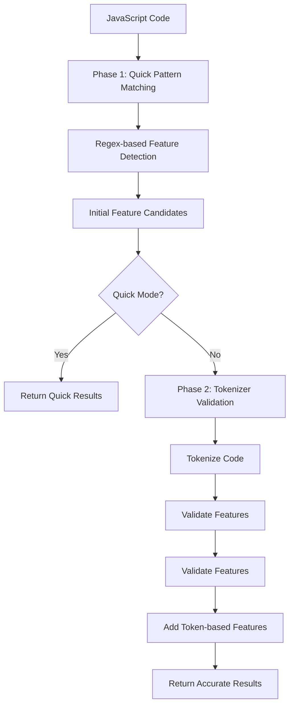
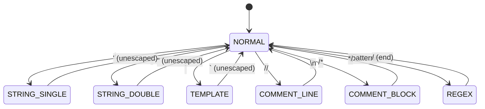
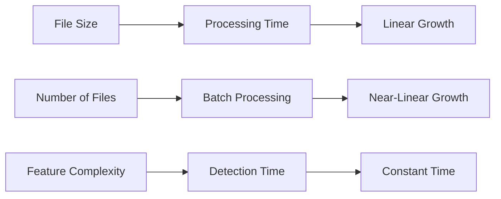

## How fast-brake Works

fast-brake revolutionizes ES feature detection through its **two-phase detection system** that combines the speed of pattern matching with the accuracy of tokenizer validation.



This approach can deliver up to **7x faster performance** than traditional AST parsers while maintaining high accuracy.

## Core Architecture Components

### 1. Detector Engine (`src/detector.ts`)

The **Detector** is the main orchestrator that manages the two-phase detection process.

```typescript
class Detector {
  // Phase 1: Lightning-fast regex scanning
  quickScan(code: string): DetectedFeature[]
  
  // Phase 2: Accurate tokenizer validation
  accurateScan(code: string, quickFeatures: DetectedFeature[]): DetectedFeature[]
  
  // Main detection method
  detect(code: string, options: DetectionOptions): DetectedFeature[]
}
```

**Key Responsibilities:**
- Orchestrates the two-phase detection process
- Manages compiled regex patterns for optimal performance
- Validates features using tokenizer analysis
- Provides singleton instance for performance optimization

### 2. Tokenizer Engine (`src/tokenizer.ts`)

The **Tokenizer** provides intelligent code analysis to accurately detect features in code.

```typescript
class Tokenizer {
  // Tokenize JavaScript code with state tracking
  tokenize(): Token[]
  
  // Get code tokens (excluding strings/comments)
  getCodeTokens(): Token[]
  
  // Track tokenizer state for accurate detection
  private state: TokenState
}
```

**Key Features:**
- **State-aware tokenization**: Tracks strings, comments, regex, and template literals
- **Accurate detection**: Validates ES features in actual code contexts
- **Token-based feature detection**: Identifies imports, exports, and complex patterns
- **Performance optimized**: Minimal memory allocation and fast scanning

### 3. Pattern Engine (`src/constants.ts`)

The **Pattern Engine** contains optimized regex patterns and feature mappings.

```typescript
// Quick detection patterns (Phase 1)
export const QUICK_PATTERNS: Record<string, RegExp> = {
  arrow_functions: /=>/,
  template_literals: /`/,
  optional_chaining: /\?\./,
  // ... 30+ patterns
};

// Feature version mappings
export const FEATURE_VERSIONS: Record<string, string> = {
  arrow_functions: 'es2015',
  optional_chaining: 'es2020',
  private_fields: 'es2022',
  // ... complete mappings
};
```

**Optimization Strategies:**
- **Pre-compiled patterns**: Regex patterns compiled at startup
- **Hierarchical organization**: Patterns grouped by ES version
- **Performance tuning**: Optimized for common cases first

## Two-Phase Detection Deep Dive

### Phase 1: Quick Pattern Matching

**Objective**: Lightning-fast initial feature detection using regex patterns.

```javascript
// Example: Detecting arrow functions
const arrowPattern = /=>/;
const matches = code.match(arrowPattern);
if (matches) {
  features.push({
    name: 'arrow_functions',
    version: 'es2015',
    line: getLineNumber(matches.index),
    column: matches.index
  });
}
```

**Characteristics:**
- ⚡ **Ultra-fast**: ~0.013ms per file
- 🎯 **High recall**: Catches most features

**Use Cases:**
- Development builds with hot reloading
- Build tools where speed is critical
- Initial feature screening

### Phase 2: Tokenizer Validation

**Objective**: Validate features and add token-based feature detection.

```javascript
// Example: Validating arrow functions
const tokens = tokenizer.getCodeTokens(); // Excludes strings/comments
const hasArrowFunction = tokens.some(token => token.value === '=>');

if (hasArrowFunction) {
  // Confirmed: arrow function in actual code
  validatedFeatures.push(feature);
}
```

**Validation Process:**
1. **Tokenize code**: Parse into tokens with context awareness
2. **Filter code tokens**: Exclude strings, comments, and regex
3. **Validate features**: Check if patterns exist in actual code
4. **Add token features**: Detect imports, exports, generators
5. **Merge results**: Combine validated quick features with token features

**Characteristics:**
- 🎯 **High accuracy**: With tokenizer validation
- 🛡️ **Context-aware**: Understands strings, comments, regex
- 📈 **Additional detection**: Finds features missed by regex
- ⚡ **Still fast**: ~0.055ms per file (2x faster than AST parsers)

## Performance Optimizations

### 1. Singleton Pattern

```typescript
let detectorInstance: Detector | null = null;

export function getDetector(): Detector {
  if (!detectorInstance) {
    detectorInstance = new Detector();
  }
  return detectorInstance;
}
```

**Benefits:**
- Reuses compiled regex patterns
- Reduces memory allocation
- Faster subsequent calls

### 2. Pattern Compilation

```typescript
class Detector {
  private compiledPatterns: Map<string, RegExp>;
  
  constructor() {
    // Compile all patterns once at startup
    this.compiledPatterns = new Map();
    for (const [name, pattern] of Object.entries(QUICK_PATTERNS)) {
      this.compiledPatterns.set(name, pattern);
    }
  }
}
```

**Benefits:**
- Patterns compiled once, used many times
- Eliminates regex compilation overhead
- Consistent performance across calls

### 3. Early Termination

```typescript
// Stop on first incompatible feature
if (options.throwOnFirst && featureIndex > targetIndex) {
  throw new Error(`Incompatible feature: ${feature.name}`);
}
```

**Benefits:**
- Faster failure detection
- Reduced processing for incompatible code
- Better CI/CD performance

### 4. Memory Efficiency

```typescript
// Reuse token arrays and minimize allocations
const tokens: Token[] = [];
// ... populate tokens in-place
return tokens; // Return same array reference
```

**Benefits:**
- Minimal garbage collection
- Consistent memory usage
- Better performance under load

## Feature Detection Strategies

### Regex-Based Detection (Phase 1)

**Simple Patterns:**
```typescript
arrow_functions: /=>/,
template_literals: /`/,
optional_chaining: /\?\./,
```

**Complex Patterns:**
```typescript
async_await: /\b(?:async\s+function|async\s*(?:\([^)]*\)|[a-zA-Z_$][a-zA-Z0-9_$]*)\s*=>|await\s)/,
destructuring: /(?:const|let|var)\s*[[{]/,
top_level_await: /^[^{]*\bawait\s/m
```

### Token-Based Detection (Phase 2)

**Import/Export Detection:**
```typescript
if (token.value === 'import' && next && (next.value === '(' || next.value === '{')) {
  features.push({
    name: 'import',
    version: 'es2015',
    line: token.line,
    column: token.column
  });
}
```

**Generator Detection:**
```typescript
if (token.value === 'function' && next && next.value === '*') {
  features.push({
    name: 'generators',
    version: 'es2015',
    line: token.line,
    column: token.column
  });
}
```

## Tokenizer State Management

The tokenizer maintains state to correctly handle different code contexts:

```typescript
enum TokenState {
  NORMAL = 0,
  STRING_SINGLE = 1,
  STRING_DOUBLE = 2,
  TEMPLATE = 3,
  COMMENT_LINE = 4,
  COMMENT_BLOCK = 5,
  REGEX = 6
}
```

### State Transitions



### Context-Aware Processing

```typescript
// Skip ES features in non-code contexts
if (this.state === TokenState.STRING_SINGLE || 
    this.state === TokenState.STRING_DOUBLE ||
    this.state === TokenState.COMMENT_LINE ||
    this.state === TokenState.COMMENT_BLOCK) {
  // Don't detect features in strings/comments
  continue;
}
```

## Error Handling Architecture

### Graceful Degradation

```typescript
try {
  // Try full mode first
  return this.accurateScan(code, quickFeatures);
} catch (error) {
  // Fallback to quick mode on tokenizer errors
  console.warn('Tokenizer failed, falling back to quick mode');
  return quickFeatures;
}
```

### Detailed Error Information

```typescript
const error = new Error(
  `ES feature "${feature.name}" requires ${feature.version} but target is ${options.target}` +
  (feature.line ? ` at line ${feature.line}:${feature.column}` : '') +
  (feature.snippet ? `\n  ${feature.snippet}` : '')
);

// Attach structured data
(error as any).feature = feature;
(error as any).target = options.target;
```

## Extensibility Points

### Adding New Features

1. **Add pattern to constants:**
```typescript
export const QUICK_PATTERNS = {
  // ... existing patterns
  new_feature: /pattern/,
};

export const FEATURE_VERSIONS = {
  // ... existing versions
  new_feature: 'es2023',
};
```

2. **Add tokenizer validation:**
```typescript
private validateFeature(feature: DetectedFeature, tokens: Token[]): boolean {
  switch (feature.name) {
    case 'new_feature':
      return tokens.some(t => /* validation logic */);
    // ... other cases
  }
}
```

### Custom Detection Logic

```typescript
// Extend detector for custom features
class CustomDetector extends Detector {
  detect(code: string, options: DetectionOptions): DetectedFeature[] {
    const features = super.detect(code, options);
    
    // Add custom detection logic
    const customFeatures = this.detectCustomFeatures(code);
    
    return [...features, ...customFeatures];
  }
}
```

## Performance Benchmarks

### Live Benchmark Results

import BenchmarkData from "../../components/docs/BenchmarkData";

<BenchmarkData />

### Detailed Performance Analysis

| Approach | 1000 Files | Single File | Memory |
|----------|------------|-------------|---------|
| **fast-brake (Quick)** | **13ms** | **0.013ms** | **4MB** |
| **fast-brake (Full)** | **55ms** | **0.055ms** | **4MB** |
| Babel Parser | ~100ms | ~2ms | ~15MB |
| ESLint Parser | ~120ms | ~2.5ms | ~18MB |
| Acorn Parser | ~80ms | ~1.8ms | ~12MB |

*Live results above show single-file performance on ES2015 test code. Detailed analysis includes batch processing and memory usage.*

### Scalability Characteristics



**Key Insights:**
- **Linear scaling**: Processing time scales linearly with code size
- **Batch efficiency**: Minimal overhead for processing multiple files
- **Feature independence**: Detection time independent of feature complexity
- **Memory stability**: Consistent memory usage regardless of input size

## Best Practices

### When to Use Quick Mode

```javascript
// Development builds - speed over accuracy
const features = detect(code, { quick: true });

// Hot reloading - fast feedback
if (check(code, { target: 'es5', quick: true })) {
  // Continue with hot reload
}
```

### When to Use Full Mode

```javascript
// Production builds - accuracy critical
const features = detect(code, { quick: false });

// CI/CD pipelines - accurate detection
fastBrake(code, { target: 'es2018', quick: false });

// Code analysis - detailed reporting
const analysis = detect(codebase, { quick: false });
```

### Performance Optimization Tips

1. **Reuse detector instances:**
```javascript
const detector = getDetector(); // Singleton
const results = files.map(file => detector.detect(file.content));
```

2. **Use appropriate mode:**
```javascript
// Development: quick mode
const devFeatures = detect(code, { quick: true });

// Production: full mode
const prodFeatures = detect(code, { quick: false });
```

3. **Batch processing:**
```javascript
// Process multiple files efficiently
const results = files.map(file => ({
  file: file.path,
  features: detect(file.content, options)
}));
```

The fast-brake architecture demonstrates how intelligent design choices can deliver both exceptional performance and high accuracy, making it the ideal choice for modern JavaScript tooling.